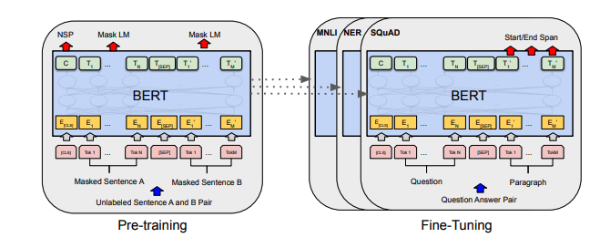
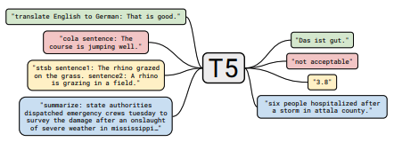

# tldr-transformers

The tl;dr on a few notable transformer/language model papers + other papers (alignment, memorization, etc). 

<ins>Models</ins>: GPT- *, * BERT *, Adapter- *, * T5, etc.

<p float="left">
<p align="middle">
  
  
</p>

<div align="center"> 
<b>BERT</b> and <b>T5</b> (art from the original papers)
</div>
<p>
  &nbsp
  &nbsp
  &nbsp
</p> 

Each set of notes includes links to the paper, the original code implementation (if available) and the <i>Huggingface</i> :hugs: implementation.  

<ins>Here is an example</ins>: [t5](notes/t5.md).  

The transformers papers are presented somewhat chronologically below. Go to the ":point_right: Notes :point_left:" column below to find the notes for each paper.  

This repo also includes a [table](notes/bigtable.md) quantifying the differences across transformer papers <ins>all in one table</ins>.  

## Contents

- [Quick Note](#Quick_Note)
- [Motivation](#Motivation)
- [Papers::Transformer Papers](#Models)
- [Papers::1 Table To Rule Them All](#BigTable)
- [Papers::Alignment Papers](#Alignment)
- [Papers::Scaling Law Papers](#Scaling)
- [Papers::LM Memorization Papers](#Memorization)
- [Papers::Limited Label Learning Papers](#FewLabels)
- [How To Contribute](#Contribute)
- [How To Point Our Errors](#Errata)
- [Citation](#Citation)
- [License](#License)

## Quick_Note 

This is *not* an intro to deep learning in NLP. If you are looking for that, I recommend one of the following: [Fast AI's course](https://www.fast.ai/2019/07/08/fastai-nlp/), [one of the Coursera courses](https://www.coursera.org/specializations/natural-language-processing), or [maybe this old thing](https://github.com/will-thompson-k/deeplearning-nlp-models). Come here after that.

## Motivation

With the explosion in papers on all things Transformers the past few years, it seems useful to catalog the salient features/results/insights of each paper in a digestible format. Hence this repo.

## Models

| Model   | Year   | Institute  | Paper   | :point_right: Notes :point_left:   | Original Code    |  Huggingface :hugs: |   Other Repo |
|    :----:   |     :----:   |    :----:   |   :----:   |    :----:   |    :----:   |    :----:   |    :----:   | 
|Transformer   |  2017  | Google|[Attention is All You Need](https://arxiv.org/abs/1706.03762)  | Too many good write-ups: <ul><li> [Harvard NLP Group](http://nlp.seas.harvard.edu/2018/04/03/attention.html) </li><li> [Jay Alammar](http://jalammar.github.io/illustrated-transformer/) </li><li> [Lilian Weng](https://lilianweng.github.io/lil-log/2018/06/24/attention-attention.html) </li><li> [Something old](https://github.com/will-thompson-k/deeplearning-nlp-models/blob/master/notebooks/transformer/README.md) </li></ul>  | |  ? | |
|GPT-3   |  2018  | OpenAI|[Language Models are Unsupervised Multitask Learners](https://cdn.openai.com/better-language-models/language_models_are_unsupervised_multitask_learners.pdf)  |  To-Do | X |  X | |
|GPT-J-6B   |  2021  | EleutherAI | [GPT-J-6B: 6B Jax-Based Transformer (**public GPT-3**)](https://arankomatsuzaki.wordpress.com/2021/06/04/gpt-j/)  |  X | [here](https://github.com/kingoflolz/mesh-transformer-jax) |  x | x |
|BERT   |  2018  | Google|[BERT: Pre-training of Deep Bidirectional Transformers for Language Understanding](https://arxiv.org/abs/1810.04805)  | [BERT notes](notes/bert.md)  | [here](https://github.com/google-research/bert) |  [here](https://huggingface.co/transformers/model_doc/bert.html)  | |
|DistilBERT   |  2019  | Huggingface |[DistilBERT, a distilled version of BERT: smaller, faster, cheaper and lighter](https://arxiv.org/abs/1910.01108)| [DistilBERT notes](notes/distilbert.md)   | |  [here](https://huggingface.co/transformers/model_doc/distilbert.html)  | |
|ALBERT   |  2019  | Google/Toyota |[ALBERT: A Lite BERT for Self-supervised Learning of Language Representations](https://arxiv.org/abs/1909.11942)  |  [ALBERT notes](notes/albert.md) | [here](https://github.com/google-research/albert) |  [here](https://huggingface.co/transformers/model_doc/albert.html)  | |
|RoBERTa   |  2019  |  Facebook|[RoBERTa: A Robustly Optimized BERT Pretraining Approach](https://arxiv.org/abs/1907.11692)  | [RoBERTa notes](notes/roberta.md)   | [here](https://github.com/pytorch/fairseq/blob/master/examples/roberta/README.md) |  [here](https://huggingface.co/transformers/model_doc/roberta.html)  | |
|BART   |  2019  | Facebook |[BART: Denoising Sequence-to-Sequence Pre-training for Natural Language Generation, Translation, and Comprehension](https://arxiv.org/abs/1910.13461)  | [BART notes](notes/bart.md) | [here](https://github.com/pytorch/fairseq/blob/master/examples/bart/README.md) |  [here](https://huggingface.co/transformers/model_doc/bart.html)  |
|T5  |  2019  |  Google|[Exploring the Limits of Transfer Learning with a Unified Text-to-Text Transformer](https://arxiv.org/abs/1910.10683)  | [T5 notes](notes/t5.md)  | [here](https://github.com/google-research/text-to-text-transfer-transformer) |  [here](https://huggingface.co/transformers/model_doc/t5.html)  | |
|Adapter-BERT |  2019  |  Google|[Parameter-Efficient Transfer Learning for NLP](https://arxiv.org/abs/1902.00751)  | [Adapter-BERT notes](notes/adapter_bert.md)  | [here](https://github.com/google-research/adapter-bert) |  -  | [here](https://github.com/Adapter-Hub/adapter-transformers)|
|Megatron-LM |  2019  |  NVIDIA |[Megatron-LM: Training Multi-Billion Parameter Language Models Using Model Parallelism](https://arxiv.org/abs/1909.08053)  | [Megatron notes](notes/megatron.md) | [here](https://github.com/NVIDIA/Megatron-LM) |  -  | [here](https://github.com/Adapter-Hub/adapter-transformers)|
|Reformer  |  2020  | Google |[Reformer: The Efficient Transformer](https://arxiv.org/abs/2001.04451)  | [Reformer notes](notes/reformer.md) | |  [here](https://huggingface.co/transformers/model_doc/reformer.html)  | |
|byT5  |  2021  | Google |[ByT5: Towards a token-free future with pre-trained byte-to-byte models](https://arxiv.org/abs/2105.13626)  | [ByT5 notes](notes/byt5.md) | [here](https://github.com/google-research/byt5) |  [here](https://huggingface.co/transformers/model_doc/byt5.html)  | |
|CLIP (<ins>@</ins>) |  2021  | OpenAI |[Learning Transferable Visual Models From Natural Language Supervision](https://arxiv.org/abs/2103.00020)  |  [CLIP notes](notes/clip.md) | [here](https://github.com/openai/CLIP) |  [here](https://huggingface.co/transformers/model_doc/clip.html)  | |
|DALL-E  |  2021  | OpenAI|[Zero-Shot Text-to-Image Generation](https://arxiv.org/abs/2102.12092)  | [DALL-E notes](notes/dalle.md)| [here](https://github.com/openai/DALL-E) | -  | |
|Codex  |  2021  | OpenAI|[Evaluating Large Language Models Trained on Code](https://arxiv.org/pdf/2107.03374.pdf)  | [Codex notes](notes/codex.md) | X | -  | |

(<ins>@</ins>  This isn't technically a Transformer.)

## BigTable

All of the table summaries found ^ collapsed into one really big table [here](notes/bigtable.md).


## Alignment

| Paper   | Year   | Institute | :point_right: Notes :point_left:     | Codes |
|    :----:   |     :----:   |    :----:   |  :----:   |    :----:   |
| [Fine-Tuning Language Models from Human Preferences](https://arxiv.org/pdf/1909.08593.pdf)| 2019| OpenAI | To-Do | None|


## Scaling

| Paper   | Year   | Institute | :point_right: Notes :point_left:     | Codes |
|    :----:   |     :----:   |    :----:   |  :----:   |    :----:   |
| [Scaling Laws for Neural Language Models](https://arxiv.org/abs/2001.08361)| 2020 | OpenAI | To-Do | None|

## Memorization

| Paper   | Year   | Institute | :point_right: Notes :point_left:     | Codes |
|    :----:   |     :----:   |    :----:   |  :----:   |    :----:   |
| [Extracting Training Data from Large Language Models](https://arxiv.org/abs/2012.07805)| 2021 | Google et al. | To-Do | None|
| [Deduplicating Training Data Makes Language Models Better](https://arxiv.org/abs/2107.06499)| 2021 | Google et al. | To-Do| None|


## FewLabels

| Paper   | Year   | Institute | :point_right: Notes :point_left:     | Codes |
|    :----:   |     :----:   |    :----:   |  :----:   |    :----:   |
| [An Empirical Survey of Data Augmentation for Limited Data Learning in NLP](https://arxiv.org/abs/2106.07499)| 2021 | GIT/UNC | To-Do | None|
| [Learning with fewer labeled examples](https://colinraffel.com/publications/probml2021learning.pdf)| 2021 | Kevin Murphy & Colin Raffel (Preprint: "Probabilistic Machine Learning", Chapter 19) | Worth a read, won't summarize here. | None|

## Contribute

If you are interested in contributing to this repo, feel free to do the following:

1. Fork the repo.
2. Create a Draft PR with the paper of interest (to prevent "in-flight" issues).
3. Use the suggested [template](notes/TEMPLATE.md) to write your "tl;dr". If it's an architecture paper, you may also want to add to the larger table [here](notes/bigtable.md).
4. Submit your PR.

## Errata

Undoubtedly there is information that is incorrect here. Please open an Issue and point it out.

## Citation

```python
@misc{cliff-notes-transformers,
  author = {Thompson, Will},
  url = {https://github.com/will-thompson-k/cliff-notes-transformers},
  year = {2021}
}
```

For the notes above, I've linked the original papers.

## License

MIT
