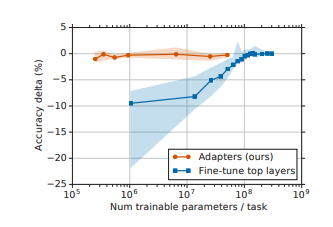
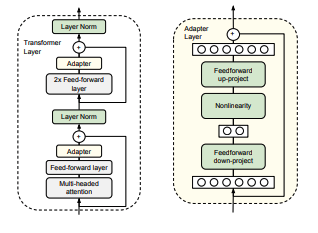

# Parameter-Efficient Transfer Learning for NLP

## Summary

| Model Name| Model Type (Encoder-Decoder, etc.)   | Pre-train Objective |  Tokenization  | Vocab Size | OOV Handling | Embeddings | Attention | Activations | Parameters | Training| Pre-Train Data | Batch Size |
|   :----: |   :----:   |     :----:   |    :----:   |  :----:   |  :----: |   :----:  |    :----: |    :----:   |    :----:   |:----:   |:----:  |:----:   |
| Adapter-BERT | Encoder-Only | Same as BERT (only fine-tuning is happening in this paper) | Same as BERT | Same as BERT | Same as BERT | Same as BERT | Same as BERT | Same as BERT | pre-trained BERT + Adapter Layers | Fine-tuning procedure: ADAM with LR increased during first 10%, followed by decaying to 0 during last 90%. LR is swept ans well as adapter size. |Same as BERT | Batch size = 32 |

## TL;DR

There are 2 typical forms of **transfer learning** in NLP: feature-based (i.e., ELMO, pre-trained embeddings) and fine-tuning (i.e., most language models). It's been shown that fine-tuning often does better than feature-based transfer learning. Both require a new set of parameters for the new task and are sharing the lower-level layers.

In the author's proposed **adapter architecture**, only the new parameters (adapter layers, top layer + layer norm params) are trained and (most) of the original parameters are untouched. The adapter layer is a **bottle-neck** architecture with a FFN->non-linearity->FFN loop. 

## Art

### Figure 1: Accuracy v. Fine-Tuning
This plot is a rather important depiction of the accuracy achieved on GLUE benchmarks. The major take-away is that adapters attain a similiar performance as fine-tuning with 2 orders of magnitude fewer parameters.

(from original paper)

### Figure 2: Adapter in Transformer
This a depiction of how the Adapter layer in inserted into the usual Transformer layer. The Adapter is a bottle-neck architecture + skip-connection. Only the green parameters are tuned during fine-tuning: adapter, layer norm + final classification layer.

(from original paper)
