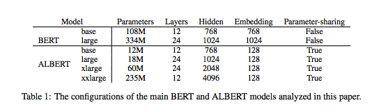
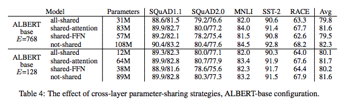
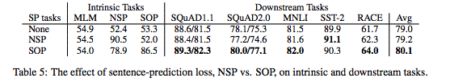
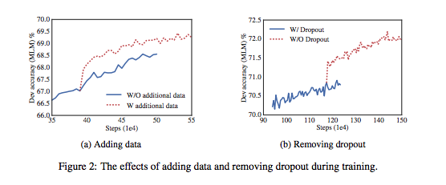
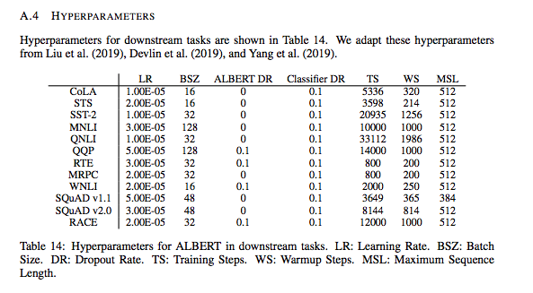

# ALBERT: A Lite BERT for Self-supervised Learning of Language Representations

## Summary

| Model Name| Model Type (Encoder-Decoder, etc.)   | Pre-train Objective |  Tokenization  | Vocab Size | OOV Handling | Embeddings | Attention | Activations | Parameters | Training | Pre-Train Data | Batch Size |
|   :----: |   :----:   |     :----:   |    :----:   |  :----:   |  :----: |   :----:  |    :----: |    :----:   |    :----:   |:----:   |:----:  |:----:   |
| ALBERT | Encoder-Only | <ul><li> **Masked Language Model (MLM) loss function (refer to BERT)** </li><li> **Sentence Order Prediction (SOP) loss** </li></ul> | SentencePiece (as opposed to BERT's WordPiece) similar to XLNet | ~30k | Same as XLNet (greedy algorithm) | SentencePiece embeddings | Encoder-only self-attention, but with different prob(masking) | GeLU (same as BERT) | **Albert-base (sharing attention layers)**: 12 layers, hidden_size=768, embed_size=128 --> **64 MM parameters**  | <ul><li>Fine-tuning is task specific (see table 14)</li><li>  **LAMB** optimizer was used w/ LR=0.00176 @ 125k steps </li></ul> | Same as BERT | 4096 batch size |


## TL;DR

Similar to Distilbert, the authors were concerned about the trade off between increases in model size and the limitations of GPU/TPU memory, training times, and inference times (but more particularly the limitations of memory required). They attack it through parameter reduction as well as a **self-supervised loss** that focuses on modeling inter-sentence coherence. Through this they were able to achieve S.O.T.A on all the usual benchmarks.

The parameter reduction takes 2 forms: 

1. **factorized embedding parameterization**: The authors note that increasing hidden size in LMs have shown improved performance (along with attention heads and layers); however, due to computational costs, they hypothesize people stopped there. In BERT, XLNet and RoBERTa, ```embedding_size == hidden_size```. The authors think that given embeddings and hidden layers have different tasks (context-independent v. context-dependent learning), they insist that ``` embedding_size << hidden_size ```. By decoupling these 2 dimensions, they go from ```VxH -> VxE + ExH``` where ```E``` is a much smaller embedding space (recall ```V=~30k```). This would effectively allow the model's hidden_size to be scaled in a way that the parameter space does not grow as quickly.

2. **cross-layer parameter sharing**: Instead of each layer having it's own unique set of parameters (and therefore meaning an increase in parameters proportional to depth), the authors designed cross-layer parameter sharing. Prior work explored this idea with standard encoder-decoder tasks versus pre-training. Instead of only sharing the FFN parameters or only sharing the attention parameters, they share **all** parameters across layers.

**Loss function**: First, the authors cite literature which show that the Next Sentence Prediction (NSP) loss in BERT does not ultimately add any empirical value in down-stream tasks. They argue that this is because of the lack of difficulty of the task (in their words: "topic prediction" versus "coherence prediction") and therefore the eliminate it from their loss function. Instead, they use a different loss on top of MLM that uses *coherence* -> **Sentence Order Prediction (SOP)**. In the case of NSP, negative examples were drawn from other documents with equal probability (and target == 0), which is why the authors claim that this loss captures topic prediction. For SOP loss, negative examples are the **same 2 sentences (A and B)** but their order swapped, emphasizing how sentences flow together. The authors show that using this loss function improves downstream performance of multi-sentence encoding tasks.

**MLM masking**: **N-gram masking** is used, where the length of each n-gram mask is selected randomly and the maximimum n-gram length was 3 words.

Overall, the results seemed mixed from sharing parameters, but the SOP task does seem to improve downstream tasks. Sharing all parameters, particularly FFN parameters, seems to have the largest ding against performance- sharing attention parameters seems negligible.

**Final model chosen**: ALBERT-xxlarge (still less than BERT-large), MLM + SOP, no drop out. Authors note its more expensive given larger structure, so suggested looking into sparse and block attention.

## Art

### Table 1: ALBERT v. BERT Model Size
This table shows how parameter-sharing and factorizing embedding and hidden layers impact the number of parameters (Note: these are showing the model size if one shares both FFN and Attention parameters across layers).



(from original paper)

### Table 4: ALBERT Shared Parameter Configurations



(from original paper)

### Table 5: NSP v. SOP Loss Functions
One can see that SOP, as predicted, by the authors proves to have better downstream behavior than NSP.



(from original paper)

### Figure 2: Ablation Study on Dropout
One can see that Dropout does dominantly worse in training (although, is the sudden bifurcation explainable?)



(from original paper)

### Table 14: Hyper-parameters for Fine-tuning



(from original paper)

