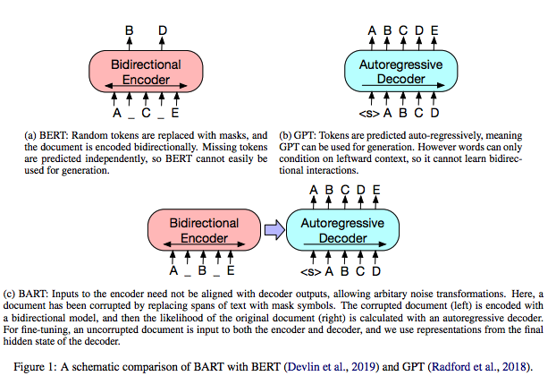
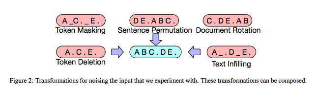
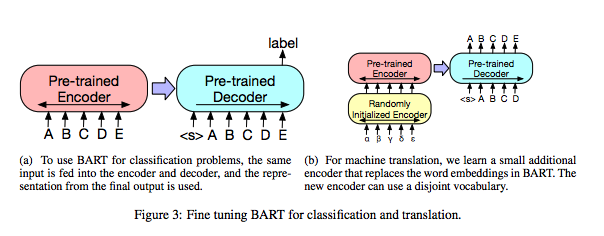

# BART: Denoising Sequence-to-Sequence Pre-training for Natural Language Generation, Translation, and Comprehension

## Summary

| Model Name| Model Type (Encoder-Decoder, etc.)   | Pre-train Objective |  Tokenization  | Vocab Size | OOV Handling | Embeddings | Attention | Activations | Parameters | Training| Pre-Train Data | Batch Size |
|   :----: |   :----:   |     :----:   |    :----:   |  :----:   |  :----: |   :----:  |    :----: |    :----:   |    :----:   |:----:   |:----:  |:----:   |
| BART | Encoder-Decoder (Transformer) | **Re-construction loss**: Usual decoder cross-entropy between decoder and original document (encoder sees corrupted document); although, they look at several variants: <ul><li> **GPT::Language Model** </li><li> **XLNet::Permuted Language Model** </li><li> **BERT: MLM** </li><li> **Multitask MLM** </li><li> **Masked Seq-to-seq** </li><ul> They use **two-stream attention** to compute likelihoods. | Same BPE encoding as GPT-2 | Same as GPT? Or RoBERTa?| Same as GPT? Or RoBERTa?| Same as GPT? Or RoBERTa? | Same as the original Transformer | GeLU | <ul><li> BART contains roughly 10% more parameters than equivalent sized BERT model: 6 encoder layers, 6 decoder layers, embed_size==hidden_size=768.</li><li> For large-scale experiments: 12 encoder, 12 decoder, hidden_size=1024.</li></ul> | <ul><li> 5MM steps. Use 30% token masking, permute sentences. </li><li>There is a different training process for NMT (2-step process)</li></ul>| 160 GB of data similar to *Liu et al 2019* | (for large scale experiments) batch_size=8K|

## TL;DR

Basically, the authors set out to combine the bi-directional encoder (BERT) and the auto-regressive decoder (GPT) in one model. Their hypothesis is that since BERT is trained to predict random tokens using bi-directional information, it cannot be used easily for text generation; conversely, GPT is designed for text generation, but lacks context for understanding other tasks. To setup the problem, a noising function is used to corrupt the original text. The authors explore a few different noising functions. BART performs as well as RoBERTa on GLUE + SOTA on some other tasks. Further, a new fine-tuning technique was developed where additional layers are stacked.

**Document corruption**: For the encoder, the following are done to corrupt the documents:

1. **Token masking**: Random tokens are sampled and replaced with MASK token. 
2. **Token deletion**: Random tokens are deleted. 
3. **Token infilling**: Drawing from Poisson distribution, different lengths of text are sampled and replaced with a single MASK token. 
4. **Sentence permutation**: A document is split based on sentences, then the sentences are shuffled in random order. 
5. **Document rotation**: A token is chosen uniformly, and the whole document is rotated such that the document starts at that token. 

## Art

### Figure 1: BART is BERT + GPT
Picture says it all. BART is essentially a composition of BERT and GPT.

(from original paper)

### Figure 2: Encoder Noise Injections
This depiction shows the different ways the corpus is distorted for the encoding task.

(from original paper)

### Figure 3: BART Fine-tuning
BART has different fine-tuning differs between classification and neural machine translation. In the latter, an additional encoder is used.

(from original paper)
