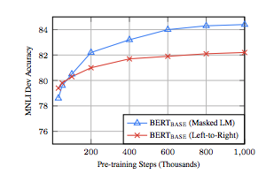

# BERT: Pre-training of Deep Bidirectional Transformers for Language Understanding

## Summary

| Model Name| Model Type (Encoder-Decoder, etc.)   | Pre-train Objective |  Tokenization  | Vocab Size | OOV Handling | Embeddings | Attention | Activations | Parameters | Training | Pre-Train Data | Batch Size|
|   :----: |   :----:   |     :----:   |    :----:   |  :----:   |  :----: |   :----:  |    :----: |    :----:   |    :----:   |:----:   |:----:   |:----:   |
|   <span style="color:blue"> BERT </span> |  <span style="color:blue"> Encoder-Only </span> |  <ul><li> <span style="color:blue"> **Masked Language Modeling (MLM)** </span> :~15% tokens chosen -> 80% replaced with [MASK], 10% random token, 10% left unchanged. A shallow decoder is used to reproduce the original text. </li><li> <span style="color:blue"> **Next Sentence Prediction (NSP)** </span> : Binary classification task, predicts if 2 sequences follow each other in corpus (useful on Q&A, etc.). Sampling is 50% 0,1.  </li></li><li> Training loss is mean of MLM + NSP likelihood </li></ul> | <ul><li> <span style="color:blue"> **Wordpiece Tokenization** </span> : [original paper](https://static.googleusercontent.com/media/research.google.com/en//pubs/archive/37842.pdf), [huggingface explanation](https://huggingface.co/transformers/tokenizer_summary.html#wordpiece) </li><li> **Token break down** :<span style="color:green"> **[CLS] token** </span> (useful for many-to-one fine-tuned tasks such as classification) + <span style="color:green"> **WordPiece tokens** </span> + <span style="color:green"> **[SEP]** </span>  token for each sentence. </li><li> <span style="color:blue">  **MAX 512 Tokens**. </span> </li></ul>  | <span style="color:blue">  30k tokens </span>  |  Greedy decomposition of token into sub-words until it finds tokens in vocabulary.   |    Sum of: **Token embeddings** (WordPiece) + **segment embedding (learned)** + **Absolute position embedding** |    **Scaled Dot-product Self-Attention** (note: advised to pad inputs on right rather than left since positional embeddings are absolute.)   |  <span style="color:blue">  **GeLU** </span> : **Dying ReLU problem** - a node can be stuck @ 0 with negative inputs, stops learning, cannot recover.   |  <ul><li> **BERT base**: 12 layers (transformer blocks), 12 attention heads, hidden size = 768 -> ~110 MM params </li><li> **BERT large**: 24 layers, 16 attention heads, hidden size = 1024 -> ~340 MM params </li><li> Generally the parameter space choices are ```embed_size (E) == hidden_size (H)```, the feed-forward size is ```4H``` and the number of attention heads is ```H/64```. To see the math on how the total number of parameters is calculated, check out this comment on BERT github [here](https://github.com/google-research/bert/issues/656#issuecomment-554718760) </li></ul> | <ul><li> Adam and L_2 weight decay </li><li> Learning rate is warmed up during first 10k steps to peak value of 1e.-4, then linearlly decayed </li><li> Models are pretrained for S= 1MM updates</li><li> No layers frozen  </li><li> Same learning rate throughout </li></ul> | Book Corpus and Wikipedia (~16 GB uncompressed) | 256 batch size, maximum length  512 |

## TL;DR

 Recall that GPT takes the original Transformer encoder-decoder model for neural translation and crafts a left-to-right decoder-only architecture. This is tantamount to only employing the "self-attention" mechanism suggested in the original paper (there were 2 types: encoder-decoder and self-attention for both the encoder and decoder...GPT uses the decoder's self-attention mechanism). The main drawback from the author's perspective is the lack of information from GPT's uni-directional approach. Instead, they suggest an "encoder-only" approach, where information is used from all directions (i.e. "bi-directional"). This means departing from the upper-right triangle self-attention mask used in GPT and instead using a mask that is based on randomly masking tokens in the corpus that will be predicted using the surrounding context - hence the name "masked language model" (detailed in table). There are some other architecture departures such as activation functions and input/embeddings.

## Art

### Fig 1: Pre-training v. Fine-Tuning
This shows the pre-training task and the various branches of fine-tuning depending on the problem.


(from original paper)

### Fig 2: Input Embedding Construction
This shows how the input representation is formed using 3 different embeddings.


(from original paper)

### Fig 4: Different Fine-Tuning Constructions
This shows the different ways the model output are used as input into another "final" layer when fine-tuned for task specific problems.


(from original paper)

### Fig 5: Left-to-Right versus MLM
This is buried in the appendix, but is a pretty important ablation study showing the difference in accuracy between MLM and Decoder style self-attention.



(from original paper)

### Table 6: Model Size v. Accuracy/Perplexity on Hold-Out Data
Here we can see the trade-off between number of layers, hidden size, attention heads and decreases in perplexity/increases in accuracy.


(from original paper)


