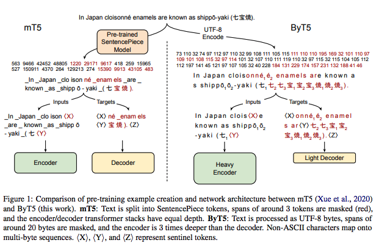
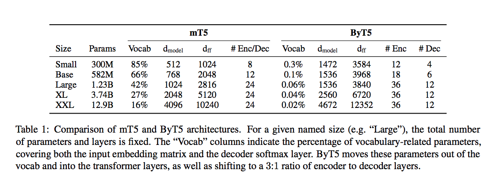
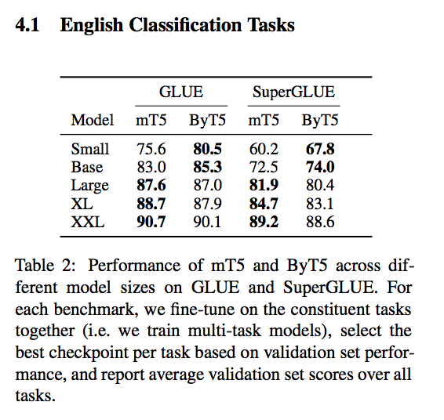
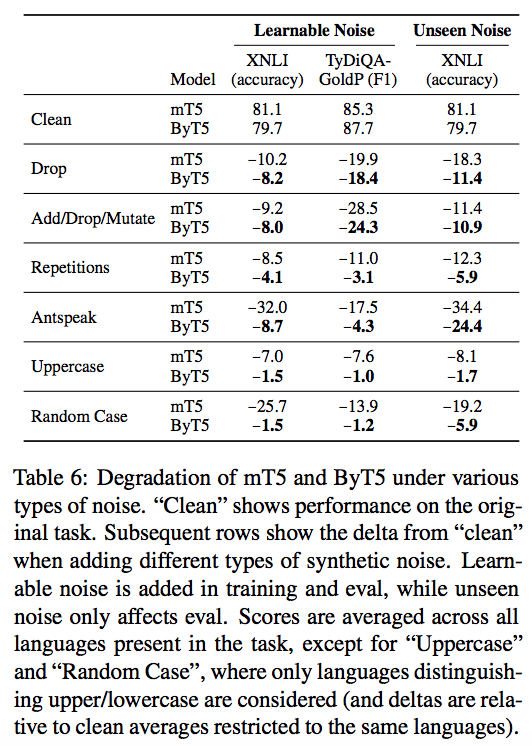

# ByT5: Towards a token-free future with pre-trained byte-to-byte models


## Summary

| Model Name| Model Type (Encoder-Decoder, etc.)   | Pre-train Objective |  Tokenization  | Vocab Size | OOV Handling | Embeddings | Attention | Activations | Parameters | Training| Pre-Train Data | Batch Size |
|   :----: |   :----:   |     :----:   |    :----:   |  :----:   |  :----: |   :----:  |    :----: |    :----:   |    :----:   |:----:   |:----:  |:----:   |
| ByT5 | Encoder-Decoder | Similar to **Span Corruption** (T5's pre-training objective) | Tokenless! (uses UTF-8 bytes) | 256 byte values + 3 special tokens | There is still an OOV token, but is not used | Only 256 token embeddings, no positional embeddings | Self-Attention + Encoder-Decoder Attention | ReLU? | Model sizes were made to match mT5 (small, base, large, XL, XXL); to compensate, increased depth of encoder ("heavy encoder") and dim_model, dim_ffn | All hyper-parameters are the same as mT5, except now: <ul><li> Sequence length: 1024 tokens/bytes </li><li> 1MM steps </li><li> batch_size = 2^30 tokens </li></ul> | Same mC4 as mT5 model |T=1024 tokens, batch_size = 2^30 tokens |
## TL;DR

Tokenizers are often an independent artifact of a model - they convert text into a sequence of tokens for downstream tasks. The value of a "token-free" model is the ability to feed the raw text (of any language!) into a model. The authors demonstrate a way of using byte sequences as a direct input to the standard Transformer architecture. Further, they show that byte-level models are significantly more robust to noise (i.e. spelling errors).

**Tokenizers: A review** Tokenizers are often used to convert a text sequnece into a series of token IDs out of a finite _vocabulary_ (map of token <-> id). The problem with building this vocabulary is how to handle OOV tokens ( _out of vocabulary_). A standard approach is to map all unknown words to ```<UNK>```. Another answer, popular in **subword tokenizers** is to greedily decompose an OOV token into a set of tokens it recognizes. This property has led it to be the gold standard of tokenizers. However, subwords still are not immune to all varations found in language: (mis)spellings, captilizations, syntatical forms of a word, etc. Also, new characters from newly encountered languages falling into the OOV token. To avoid these pitfalls, the authors suggest exploring **token-free** models, ones that do not require a vocabulary at all and make DL true end-to-end models. Further, byte-level models can in theory read in arbitrarily long sequences of text and only require 256 (8 bits) embeddings. By relying on dense representations of the bytes themselves, models should be able to generalize more effectively and be more immune to the actual spelling variations of words. **However**, the biggest problem is that the lengths of sequences become much longer.


**ByT5 Design**: 

The basis of the ByT5 is the mT5 model (which inherits from T5). The goal is create a text-to-text model for 100+ languages. Here are the changes:

1. **Byte-level input**: UTF-8 bytes are fed into the model directly without **any** pre-processing. Each byte is mapped directly to a vocabulary of 256 byte values + ```<PAD>```, ```<EOS>```, ```<UNK>``` (though this is not used since the embedding is complete).
2. **Pre-training objective**: Pre-train objective is similar to span corruption from T5.
3. **Heavy encoder**: Unlike the previous * T5 models, the byT5 has a much deeper encoder ("heavy") than decoder (3:1 ratio), which makes it more similar to BERT style models. 

Given the reduction in vocabulary-based parameters (which accounted for as much as 66% of mT5), the authors increased the number of layers and size of the hidden_size and ffn_size of these layers. They did this mainly to make a rough comparison of model size with mT5. This also means the model requires more FLOPs for a given sequence versus a standard vocabulary-based model.


**Noise Studies**: This is one of the really interesting parts of the study where the authors attempt to see how noise affects the results of the mT5 and byT5 on different NLP tasks. They introduce synthetic noise on text using 6 different noising schemes:

1. <ins> Drop </ins>: They drop 10% of characters. 
2. <ins> Add/Drop/Mutate </ins>: At each character position, there is a 10% chance of doing one of these operations. 
3. <ins> Repetitions </ins>: Each character has 20% chance of ~2 repetitions appended to a character. 
4. <ins> Antspeak </ins>: Weird conversion I've never seen. 
5. <ins> Uppercase </ins> 
6. <ins> Random case </ins> 

The further distinguish between **learnable noise** (noise that is applied during fine-tuning and evaluation) and **unseen noise** (only in evaluation). Reviewing Table 6, you can see on average the byT5 does better. 


## Art


### Figure 1: mT5 v. byT5 Design
This is a great illustration comparing the 2 encoder-decoder architectures. The byT5 reads in UTF-8 bytes on a 1028 byte long sequence. To compensate for the loss of vocabulary specific parameters, the authors made a much deeper encoder than decoder (as opposed to a symmetric number of parameters and layers).



(from original paper)

### Table 1: mT5 v. byT5 Parameters
To make an apples-to-apples comparison of model size, the authors made the byT5 model have a similar number of parmaeters per "size". This required increasing the dim_model and dim_ffn sizes as well as increase the depth of the encoder. 



(from original paper)

### Table 2: mT5 v. byT5 Performance



(from original paper)

### Table 6: Noise Study
This table shows the degredation of signal due to noise injected into the text. Hugely important table. 



(from original paper)