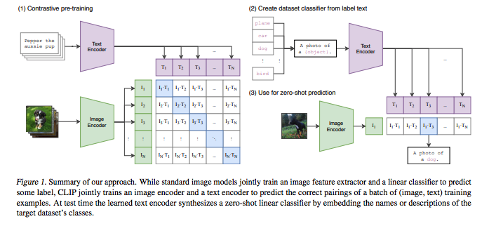
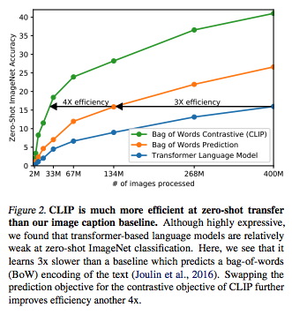
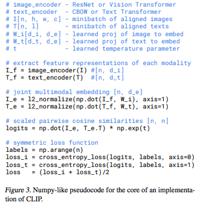
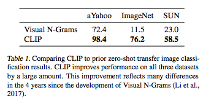

# Learning Transferable Visual Models From Natural Language Supervision

## Summary

| Model Name| Model Type (Encoder-Decoder, etc.)   | Pre-train Objective |  Tokenization  | Vocab Size | OOV Handling | Embeddings | Attention | Activations | Parameters | Training| Pre-Train Data | Batch Size |
|   :----: |   :----:   |     :----:   |    :----:   |  :----:   |  :----: |   :----:  |    :----: |    :----:   |    :----:   |:----:   |:----:  |:----:   |
| CLIP | Encoder-Only (2 Transformer-based Encoders: Text + Image) | Cross-Entropy loss (to minimize cosine similarity a la constrastive learning) | For Text Encoder: BPE | For Text Encoder: ~50k | Same as GPT | Multi-modal embeddings combining text,image features | Used in both text and image encoders differently | linear projections to embedding | In base Text Encoder, 63M| Adam optimizer with weight decay, Cosine scheduler,learnable temperature | WebImageText dataset, 400MM (text,image) pairs | 32k |


## TL;DR

**Note**: This model may not be considered a language model or transformer, but it uses attention in an interesting way, so worth a read. Also note that this paper is on the longer side, 48 pages. 

**Most interesting quote**: (from blog post) "Deep learning systems are often reported to achieve human or even superhuman performancey on ImageNet that surpassed reported human top-5 accuracy on vision benchmarks, yet when deployed in the wild, their performance can be far below the expectation set by the benchmark. In other words, there is a gap between “benchmark performance” and “real performance.” We conjecture that this gap occurs because the models “cheat” by only optimizing for performance on the benchmark, much like a student who passed an exam by studying only the questions on past years’ exams. In contrast, the CLIP model can be evaluated on benchmarks without having to train on their data, so it can’t “cheat” in this manner. This results in its benchmark performance being much more representative of its performance in the wild. To verify the <ins>“cheating hypothesis”</ins>, we also measure how CLIP’s performance changes when it is able to “study” for ImageNet. When a linear classifier is fitted on top of CLIP’s features, it improves CLIP’s accuracy on the ImageNet test set by almost 10%. However, this classifier does no better on average across an evaluation suite of 7 other datasets measuring “robust” performance" --> **Zero-shot performance is true robust performance, everything else is probably peaking**.


The authors motivate the problem by observing that breakthroughs in NLP were due in large part by pre-training using web-sourced text (as opposed to needing very large, crown-sourced, high-quality "gold-label" labeled datasets). They ask if this is possible as well for CV, which is predominantly still trained on hand-labeled datasets. Note that these models are generally *discriminative models*, attempting to learn class membership for a given image. For instance, the authors point out that *Noisy Student EfficientNet-L2* requires 33 TPUv3 core-years to train, which is a lot of resources for predicting only *1000* ImageNet classes.

The authors' contribution is the study of image classifiers trained with natural language understanding at large scale through **C.L.I.P.** - Constrastive Language-Image Pre-training. They find that this model architecture is able to learn to preform a wide-range of tasks during pre-training, including OCR, geo-locatization, etc. Further, the model is able to achieve SOTA results at 4x the effiency of a Transformer model.


**CLIP Motivation**: The core term in the literature is NLS (**natural language supervision**). By pairing text understanding to image recognition, it allows the flexibility of zero-shot transfer.

The authors constructed a new dataset of 400 MM (image, text) pairs derived from 500k queries on the internet which they call **WebImageText**.

The authors first attempted an approach of jointly training an image CNN + text Transformer, but scaled less efficiently than a simply BOW appraoch of the same text. The crux of the matter is that these *generative models* are trying to learn the <ins>exact language to describe an image </ins>, which is hard. In comparison, the **constrastive learning** literature requires an order less compute with the same prediction power. Further, the objective they pre-train is thought to allow for unseen class generalization better than the conventional learning a specific set of classes.

**Contrastive Pre-Training**: Taking a page out of the constrastive learning space, CLIP's ultimate goal is to identify which (image,text) belongs to which ```NxN``` category. This is done by training the embeddings derived from the outputs of image and text encoders to <ins> maximize the cosine similarity </ins> of image and text embeddings for ```N``` real pairs (i.e. <ins> the diagonal in Figure 1 </ins>) and trying to minimize the cosine similatiry for ```N^2-N``` negative pairs (the off-diagonal elements). The cross entropy loss is symmetric between these 2 objectives. Instead of using non-linear projections, they use a linear projection from ```encoder:->embedding```. 

**Encoders**: 

1. **Image**: The authors explored 2 models: (1) ResNet-50 design with an attention-based pooling layer (2) Vision Transformer. 
2. **Text**: The authors explored 2 models: (1) CBOW or (2) Transformer, with base 63M-parameter, 12-layer, 76-max sequence length, 8 attention heads, BPE encoding for vocab of ~ 50k. This model uses **MLM** (masked self-attention)

**Ablation & Zero-Shot studies**: There is a lot more to this paper, specifically in the ablation and zero-shot studies, which you should check-out. Too much to summarize.


## Art


### Figure 1: Clip Architecture (Important!)
This is a great depiction of how CLIP is trained and used in a zero-shot setting. Notice that the text-encoder and image-decoder are both producing an embedding (through linear projection of the feature representations) which then is used to calculate a pairwise cosine similarity. The goal is to minimize the distance for N pairs and maximize the distance for the rest. This translates to trying to maximize the cosine similarity of the diagonal elements via cross-entropy and minimizing the cosine similarity for the off-diagonal elements.



(from original paper)

### Figure 2: Clip Efficiency
This is a depiction of how the zero-shot accuracy of CLIP scales with number of data points. Further, it shows the efficiency of data relative to information learned.



(from original paper)

### Figure 3: Clip Pseudo-code



(from original paper)

### Table 1: Zero-shot performance

This shows how the prior SOTA is beaten by CLIP.



(from original paper)
