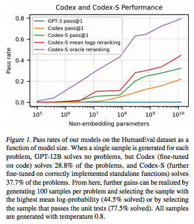
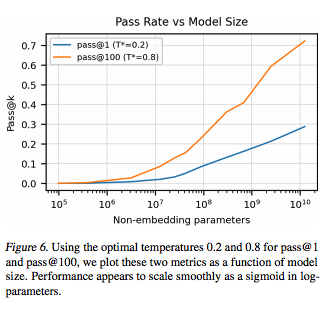
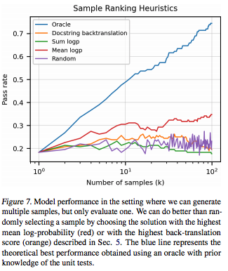
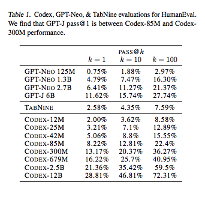

# Evaluating Large Language Models Trained on Code

## Summary

| Model Name| Model Type (Encoder-Decoder, etc.)   | Pre-train Objective |  Tokenization  | Vocab Size | OOV Handling | Embeddings | Attention | Activations | Parameters | Training| Pre-Train Data | Batch Size |
|   :----: |   :----:   |     :----:   |    :----:   |  :----:   |  :----: |   :----:  |    :----: |    :----:   |    :----:   |:----:   |:----:  |:----:   | 
| Codex | Decoder-Only (GPT) | The usual "causal" GPT decoding problem is presented |  BPE | ~50k + white space tokens | GPT-3 construction | GPT-3 construction| GPT-3 construction | GPT-3 construction | Large model was 12 B parameters| Training was similar as GPT: 175 step linear warm up, cosine learning rate decay. Training lasted 100B tokens using Adam Opimitizer with weight decay. | 54 million open repositories on Github were scraped. After a number of filters, the final dataset was 159 GB.| ?|


## TL;DR

Codex is a GPT model fine-tuned on publicly available code from GitHub with the goal of writing code based on docstrings. In comparison to other GPT-* models, it achieved SOTA results on HumanEval. Further, the sampling strategy from their generative model dramatically increased the number of problems Codex solved. 

**Results**: 

<ins> Single sample results </ins>: 300M param model solved 13.2%; 12B param model solved 28.8%. After fine-tuning on correctly implemented function dataset, <ins> Codex-S </ins> got up to 37.7%.

<ins> N>1 (i.e. 100) sample results </ins>: Using <ins> nucleus sampling </ins>, 100 samples are drawn with a top p=0.95. The question of how to chose a sample is an important question. If the authors peeked and knew which sample would pass (**the "oracle strategy"**), Codex-S gets one correction function 77.5% of the time. If the **mean log-probability** is chosen, the accuracy is 44.5% of the time. Figure 7 shows the different outcomes for this.

For a comparison, 6B parameter GPT-J solved 11.4%.  

**Codex Training Set**: 

54 million open repositories on Github were scraped. After a number of filters, the final dataset was 159 GB.

<ins> HumanEval Test Dataset </ins>: The objective for Codex is to develop standalone Python functions from docstrings and evaluate the correctness via unit testing. The authors developed a HumanEval test dataset of 164 "leetcode", comprehension and arithmetic problems. Evaluation is determined by passing the unit tests. 

Unit tests are the success criteria as the authors believe that BLEU and other match-based metrics fail to account for the complexity of code solutions. In fact, they provide evidence that there are solutions that are functionally incorrect yet achieve high BLEU scores.

The main metric used is <ins> Pass@k </ins>. The originally proposed version of this metric in the literature calculates the total fraction problems solved, i.e., ```pass@100``` means the percentage of successful trials out of 100. The author notes the high variance of this metric and derive an unbiased estimator of this metric using the expectation derived from a Binomial distribution.

**Training**: Codex was initialized as the usual GPT but fine-tuned using the Github dataset. They note, however, interestingly, that they did not think there was significant value to the pre-training, other than faster convergence. 

Training was similar as GPT: 175 step linear warm up, cosine learning rate decay. Training lasted 100B tokens using Adam Opimitizer with weight decay.

The tokenizer employed was the usual GPT-3. *Interestingly*, the authors observe that the <ins> distribution of words in Github is very different than natural text </ins>, and therefore their tokenizer is not the best for this dataset. To compensate, they added in tokens for representing whitespace of different lengths.


**Problem setup**: The input presented to the decdoer isa header, signature and docstring. The decoder's output is sampled until it arrives at one or more terminating sequence tokens. Figure 2 does a great job illustrating.


## Art

### Figure 1: Codex Performance
This shows pass rates as a function of model size. Mean log(p) is an encouraging metric of performance without peaking.



(from original paper)


### Figure 6: Pass Rate v Model Size v Temperature
This shows how controlling for temperature also plays an imporant role in outcomes. Higher temperatures equates to more diversity - since their metrics reward any correct solution, that would be helpful.



(from original paper)

### Figure 7: Sampling Heuristics
This is an important plot related to sampling strategy as it relates to pass rate. The oracle strategy is peeking; however, ```mean log(p)``` seems to be promising.



(from original paper)

### Table 1: Results
Results of transformers on HumanEval test set.



(from original paper)

