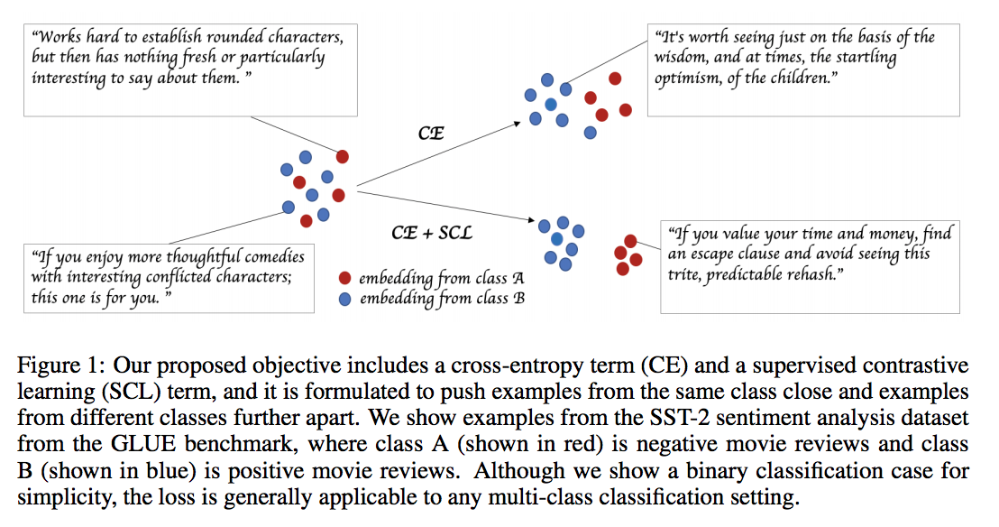
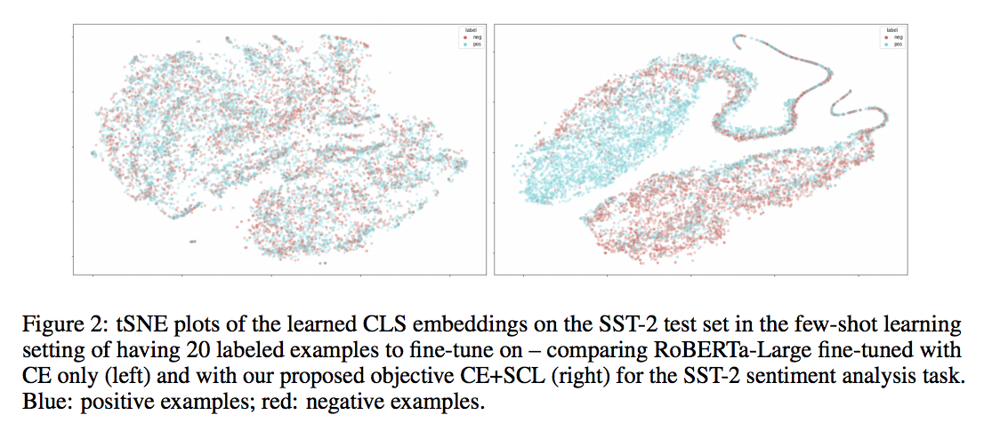
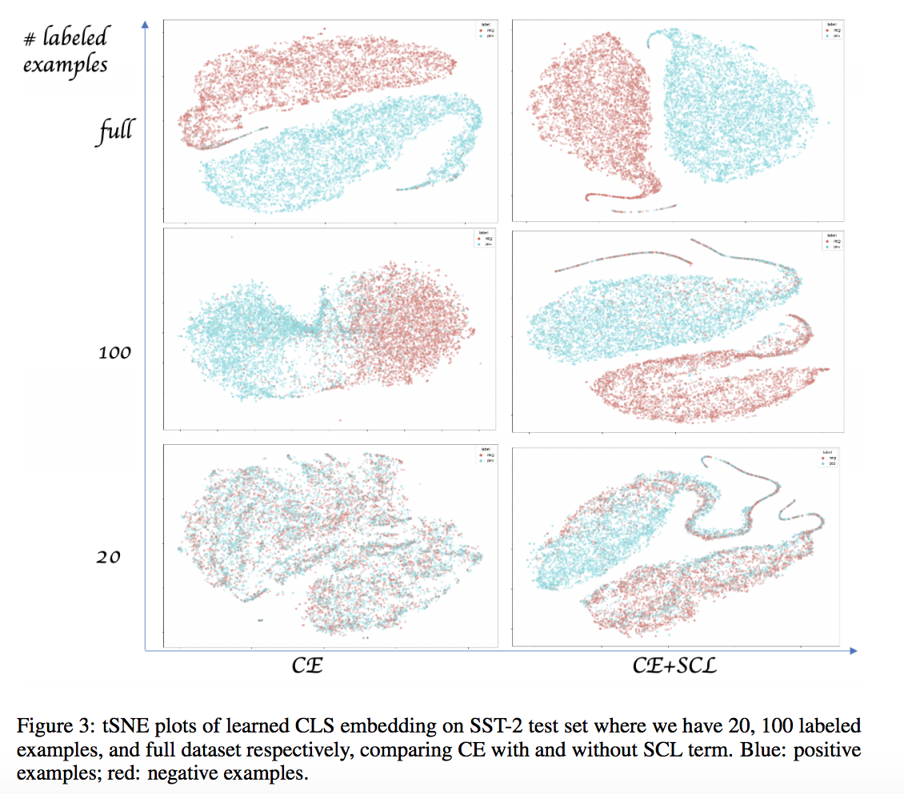
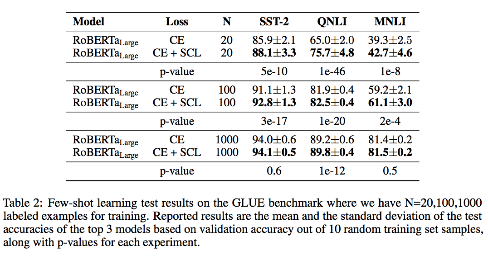
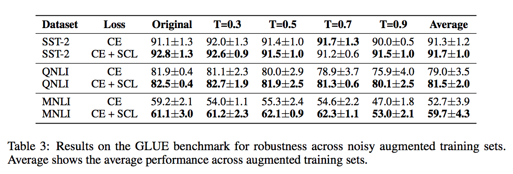

# Supervised Contrastive Learning for Pre-trained Language Model Fine-tuning

## Summary

| Model Name| Model Type (Encoder-Decoder, etc.)   | Pre-train Objective |  Tokenization  | Vocab Size | OOV Handling | Embeddings | Attention | Activations | Parameters | Training| Pre-Train Data | Batch Size |
|   :----: |   :----:   |     :----:   |    :----:   |  :----:   |  :----: |   :----:  |    :----: |    :----:   |    :----:   |:----:   |:----:  |:----:   | 


## TL;DR

***Motivation**:

The current state of the art of NLP is to first pre-train a model on an auxiliary task and then fine-tune to a specific problem using cross-entropy. 

<ins>Cross-entropy has a number of problems</ins>:

1. <ins>Poor generalization</ins>: Models trained using CE are shown to display poor generalization performance + robustness to noise. The current best practices suggested by people include <ins>label smoothing</ins> or <ins>knowledge distillation</ins> or <ins>self-training</ins>. 
2. <ins>Unstable across runs</ins>: CE also shows instability in the face of few shot learning. Currently empirical evidence suggests fine-tuning for more iterations, re-initing the top layers, etc. makes the fine-tuning stage more stable. 

In the context of few-shot learning, the authors propose adding a <ins>Supervised Contrastive Learning (SCL)</ins> term to the fine-tuning objective. It's intuitive to think of different classes being separated in an embedding space- this loss function would partition the space futher.

**Result**: By including this term in their loss function, the authors found they were able to beat RoBERTa(Large) on a number of GLUE benchmarks, particularly those in a few-shot learning context (<=1000) and in the presence of noise.

**SCL Loss**: The inclusion of this loss takes the encoding output of any particular datapoint in a batch (the representation prior to the final softmax layer) and attempts to minimize the distance of the ```[CLS]``` between 2 datapoints of similar class membership. <ins>Temperature</ins> as a hyper-parameter can be thought to influence the boundary - lower temps usually means creating harder negatives / more margin-based training, similar to triplet loss, except this objective <ins>only focuses on positive cases</ins>. <ins>Note</ins>: Recall in triplet loss that this is achieved by comparing both postive and negative cases (as in self-supervised contrastive loss). 

**Setup**: GLUE benchmarks are used with the ROBERTa(Large) model as the workbench.

## Art

### Figure 1: SCL separating classes



(from original paper)

### Figure 2: Class embedding separation



(from original paper)

### Figure 3: Class embedding separation v. N



(from original paper)

### Table 2: Few-shot learning results
Glad to see standard deviations for once in a table!!!



(from original paper)

### Table 3: Noise injection study



(from original paper)


