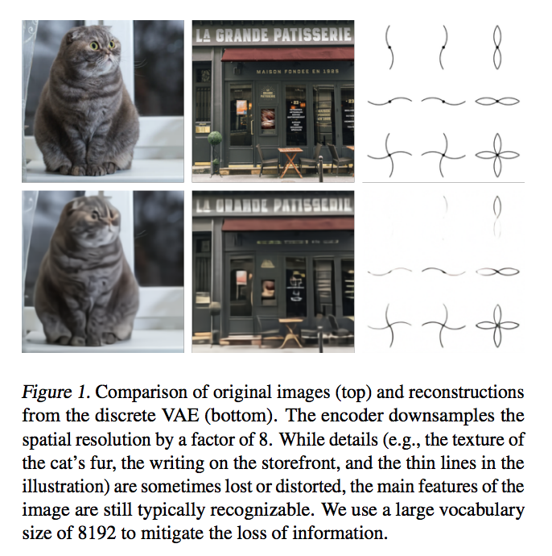
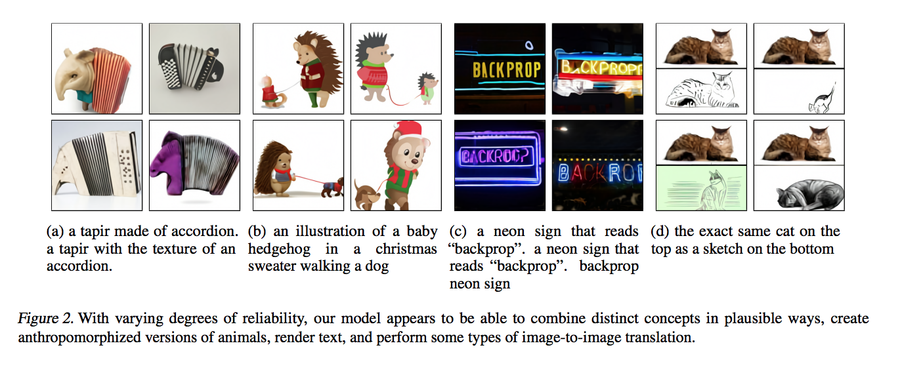
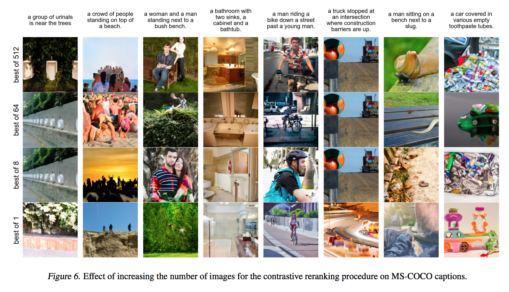
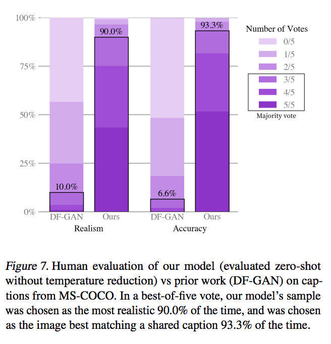

# Zero-Shot Text-to-Image Generation

## Summary

| Model Name| Model Type (Encoder-Decoder, etc.)   | Pre-train Objective |  Tokenization  | Vocab Size | OOV Handling | Embeddings | Attention | Activations | Parameters | Training| Pre-Train Data | Batch Size |
|   :----: |   :----:   |     :----:   |    :----:   |  :----:   |  :----: |   :----:  |    :----: |    :----:   |    :----:   |:----:   |:----:  |:----:   |
| DALL-E | Decoder-Only (read about attention) | no pre-training/fine-tuning per se | BPE for text + pixel tokens | text=16,384; image=8,192 | greedy? | token | 3 types of attention: text-to-text (causal), text-to-image, image-to-image attention | GeLU? | Up to 12 BN! |  training broken out into 2 steps: 1. dVAE (gumbel-softmax relaxation) 2. transformer (cross-entropy) with 16-bit precision | Conceptual Captions + proprietary dataset |  per-gpu=8, total_batch=512 |


## TL;DR

Compared to prior art, the authors demonstrate that training a 12 BN parameter autoregressive transformer on 250 MM (text/caption ,image) result in a high fidelity ```text-> image``` generative model. Further, the model produces a high quality image generation on MS-COCO <ins> zero shot </ins>, without any of the training labels.

**Model Construction**: 

First, it's worth mentioning <ins> pre-processing </ins>. Pixels and text are both converted into tokens:

1. **text tokenization**: The text goes through OpenAI's favorite BPE tokenization with a **text vocab of 16,384**. Each caption is represented by 256 tokens. 

2. **image tokenization**: Images also are represented by tokens with a **pixel vocab of 8,192**. Each image is represented by 1024 tokens (32x32). 


Instead of directly training a transformer on the raw pixel-tokens, which would require an inordinate amount of memory, the authors construct a 2-stage training process:

1. **discrete variational autoencoder (dVAE)**: Similar to VQVAE, the authors used <ins> gumbel-softmax relaxation </ins> to compress the 256x256 image into 32x32, or as they call it, "learning the visual codebook" (see details in appendix). In their training process, they first train this model to accuractely represent the images. The dimensionality of the problem by 192x. 


2. **[text,image] decoder-only transformer**: Concatenating 256 BPE-encoded text tokens with 32x32 (1024) image tokens, this input is given to an autoregressive, decoder-only transformer to model the joint distribution over the text and image tokens. In their training process, this model is trained after the dVAE is trained. The tokenization scheme is mentioned above. The image tokens are simply derived as ```argmax sampling``` from the dVAE. In terms of the transformer, there are **3 kinds of attention** used in the model: (1) <ins> text-to-text attention </ins> via auto regressive/ causal attention mask (2) <ins> image-to-image attention </ins> via row, column or conv attention and (3) <ins> image-to-text attention </ins>. The authors achieved this in a single attention mechanism versus building separate attention operations. This model is trained via cross-entropy for image and text, where most weight goes to the image loss. 


**Training Objective**: They are interested in maximizing the model's log likelihood over the image and text tokens per usual. This is intractible, so we can break this out into our 2 stages of modeling and instead <ins> maximize ELBO </ins> as expected and trained separately. 

**Dataset**: For <=1.2 BN parameter DALL-E, they used the Conceptual Captions dataset of 3.3 MM datapoints. For >=1.2 BN, <=12 BN params, they created their own dataset similar to JFT-300M. 

**Training Hacks**: To save GPU memory, they store <ins> 16-bit precision</ins> and re-compute activations in resblocks during backward pass. They found that for >= 1 BN parameter models this was a challenge as the exponents of the activation gradients deeper in the model got rounded to zero a la <ins> underflow </ins>. Their solution was to implement independent "gradient scales" for each resblock. Also, their larger models were too large to keep in a single GPU's memory, so they employed <ins> parameter sharding </ins>. 

**Sample Generation**: This was an interesting idea - similar to CLIP, a <ins> pre-trained contrastive model </ins> is used to select the best (image, text) pair generated. The highest ranking pair is then submitted.


## Art

### Figure 1: Downsampling via dVAE
This shows the before/after of using dVAE to compress/downsample an image before handing it to the transformer.



(from original paper)

### Figure 2: DALL-E Generation Variance



(from original paper)

### Figure 6: Contrastive Re-ranking
Basically, by generating more samples and selecting "the best" using CLIP, the quality of the output was better. 



(from original paper)

### Figure 7: DALL-E Performance



(from original paper)
