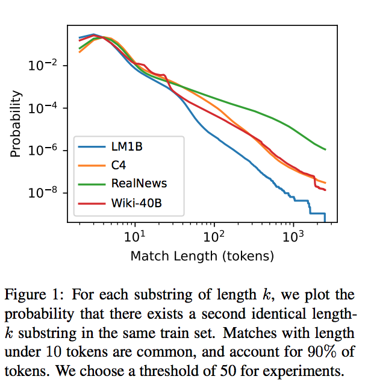
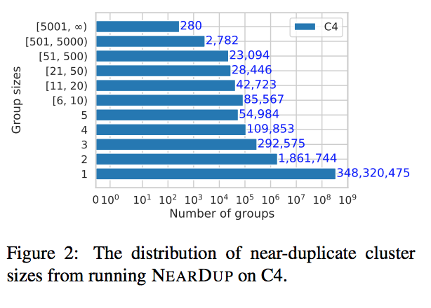
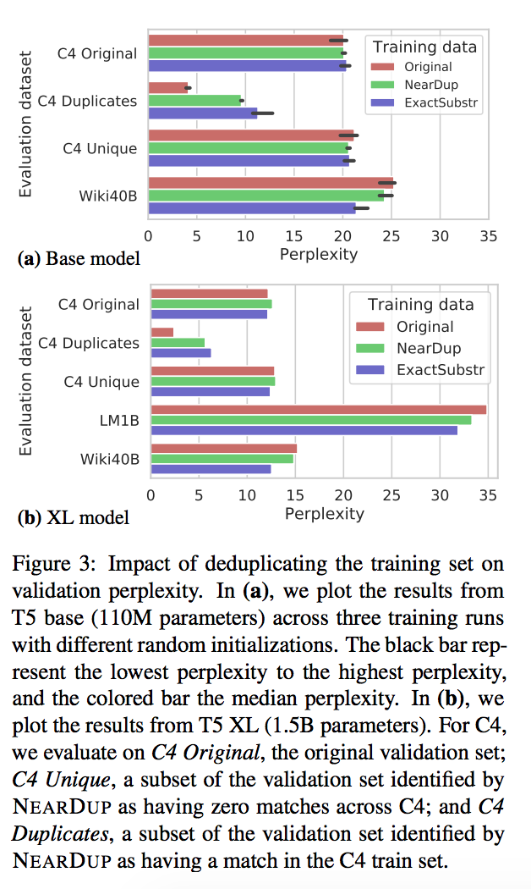
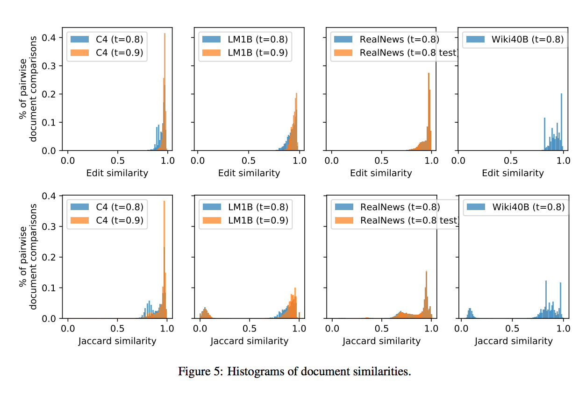
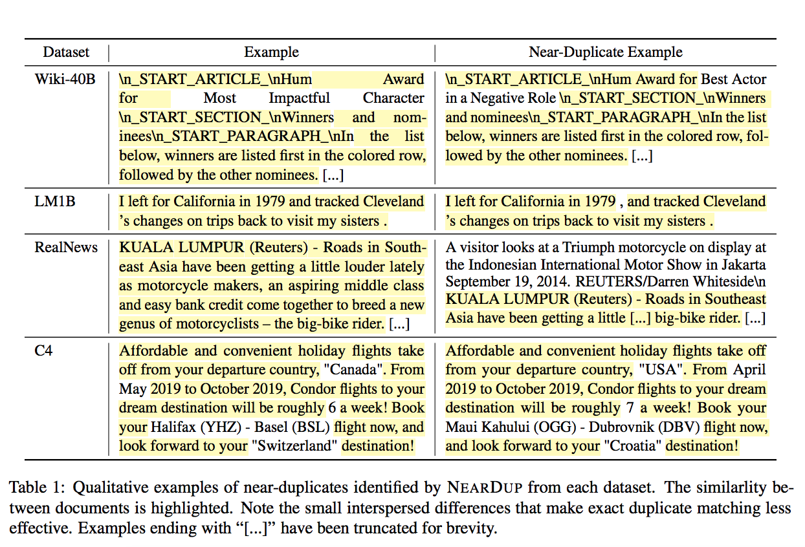

# Deduplicating Training Data Makes Language Models Better

## Summary

| Model Name| Model Type (Encoder-Decoder, etc.)   | Pre-train Objective |  Tokenization  | Vocab Size | OOV Handling | Embeddings | Attention | Activations | Parameters | Training| Pre-Train Data | Batch Size |
|   :----: |   :----:   |     :----:   |    :----:   |  :----:   |  :----: |   :----:  |    :----: |    :----:   |    :----:   |:----:   |:----:  |:----:   | 


## TL;DR

**The problem**:

An important reason for the recent SOTA results achieved by transformers is due to very large text datasets, on the order of 100s of GB. Given the size of these datasets, they suffer from a litany of biases that cannot be captured by perplexity or validation loss. This in turn is learned by the models that are trained on these datasets.

One bias is **duplicated training examples** and is quite pervasive. Attacking this problem at scale is a challenge.

According to the authors, <ins>there are a few reasons to remove deduplicated data</ins>:

1. >=1% of tokens output by language models in studies appear to be part of a memorized sequence. This is a problem in some studies, where <ins>they show that LMs are at risk of memorizing sensitive information</ins>. Deduping reduces this to 0.1%. 

2. There is train-test overlap in many datasets, even though not intended (like in C4).

3. Obvious reducing the size of training data is good from a computation budget perspective.

4. Deduping doesn't reduce perplexity, and in fact might reduce perplexity on other hold-out sets. 

5. When language models are trained on web-crawled datasets (per usual), it's also possible to that there can be **train/test leakage** between a training set and the fine-tuning test sets. (<ins>Note:</ins>: several authors try to remove these "contaminated" datasets from training; GPT-3 did the opposite are removed the data from the eval sets-> **over 90% of tasks were flagged as potentially contaminated**).

**Model**: These use a GPT family of transformer for their experiments in text generation.

**Datasets**: Wiki-40B, LM1B, C4, RealNews

**Solution Overview**:

The authors propose 2 techniques for combating duplication:

1. <ins>Exact substring match</ins>: Identfiy vertabim strings that are repeated. Obviously, this is super inefficient.

2. <ins>Approximate full document match</ins>: Using hash-based techniques, identify pairs of documents with high n-gram overlap. These 2 methods are <ins>suffix array</ins> and <ins>minHash</ins>.

**Suffix Arrays**:

Obviously, the naive exact-substring match approach is quadratic ```O(N^2)``` in complexity. 

Suffix arrays are an interesting alternative. If the entire dataset is treated as a giant sequence, then suffix arrays allow for sub-string queries in ```O(N)``` time. The dataset is partitioned into a suffix array and then a search can occur for adjoint entries that share a common prefix. This can be done in an easily parallelizable way.

**minHash Algorithm**: 

This approach has been used in other papers on LM as well. The idea is to use a hashing function to calculate an approximate <ins>Jaccard index</ins> between 2 documents - if it is sufficiently high, those 2 documents are likely copies of each other. A probability function is derived from the Jaccard index to establish the probability that 2 documents are the same.

The authors say that 2 documents are <ins> duplicates iff minHash>=0.8 and editSimilarity>=0.8</ins>

**Results**: 

The authors found a significant amount of deduplication within their datasets using these 3 methods mentioned: ~3% - 14% of near duplicate examples. 


## Art

### Figure 1: Sub-string occurrence in each dataset
Noting the probability of seeing a second copy of a string in another part of the data. They set their k>=50.



(from original paper)


### Figure 2: Near-duplicate cluster sizes



(from original paper)

### Figure 3: Dedup impact on ppl



(from original paper)

### Figure 5: Document similarities

Edit and Jaccard similarities



(from original paper)

### Table 1: Visualizing near-dups

This is a pretty nice visual 



(from original paper)