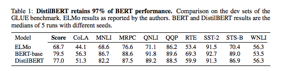
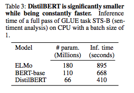

# DistilBERT, a distilled version of BERT: smaller, faster, cheaper and lighter

## Summary

| Model Name| Model Type (Encoder-Decoder, etc.)   | Pre-train Objective |  Tokenization  | Vocab Size | OOV Handling | Embeddings | Attention | Activations | Parameters | Training| Pre-Train Data | Batch Size |
|   :----: |   :----:   |     :----:   |    :----:   |  :----:   |  :----: |   :----:  |    :----: |    :----:   |    :----:   |:----:   |
| DistilBERT | Encoder-Only (Distilled version of BERT) | **Triplet loss**: (1) MLM + (2) Distillation + (3) Cosine-Distance (No NSP)| Same as BERT | Same as BERT | Same as BERT | Embeddings are similar to BERT, except the segment embeddings are removed | Same as BERT | Same as BERT | 66M parameters | Same as BERT (I think) | Same as BERT | 4096 batch size |

## TL;DR

DistilBERT is the brainchild of Huggingface and uses **knowledge distillation** to capture the pre-training phase of BERT. Typically, a classification model's objective function attempts to minimize the cross entropy between the predicted distribution and the one-hot empirical distribution. A good model in theory will predict high probabilities on the correct class and close to 0 on all others (yet, this is often not the case). In the distillation paradigm, there is a **student** (distilBERT) and **teacher** (BERT). There is a **distillation loss** in the objective where instead of the one-hot used in a typical cross entropy, there is instead the *teacher's predicted probability* multiplied by the *student's surprisal function*. On top of the normal "masked language model" cross-entropy loss, there is a **cosine embedding** loss to align hidden vectors.

Prior to this paper, most prior work explored distillation in the context of fine-tuning/ task-specific models. To achieve this goal, a triplet loss was used (mlm, distillation, cosine-distance). Ultimately, this model has 40% fewer parameters than BERT base, runs 60% faster and still ~ 97% of BERT's performance on GLUE. Further, this smaller model doesn't suffer from the same inference time issues that large language models such as BERT, RoBERTa, XLNet require - it can even be run on mobile devices.

**Other differences to note**: 

- distilBERT used **huge** batch sizes ~4k with gradient accumulation where BERT used batch sizes on the order of 8-128. They took the idea from RoBERTa paper.
- Architecture modifications:
 > Dynamic masking as opposed to static masking.  
 > Reduced number of layers by factor x2.  
 > Discarded the Next Sentence Prediction and segment embeddings (similar to RoBERTa).  

 **Note:** Google Research also wrote a paper on knowledge distillation titled [Well-Read Students Learn Better: On the Importance of Pre-Training Compact Models](https://arxiv.org/pdf/1908.08962.pdf). Also, if you look on the BERT github page, .there are several contributions of much smaller language models ("tiny", etc.)

## Art

### Table 1: DistilBERT performance

(from original paper)

### Table 3: DistilBERT inference time
Note: These times are 1 batch size on a CPU

(from original paper)
