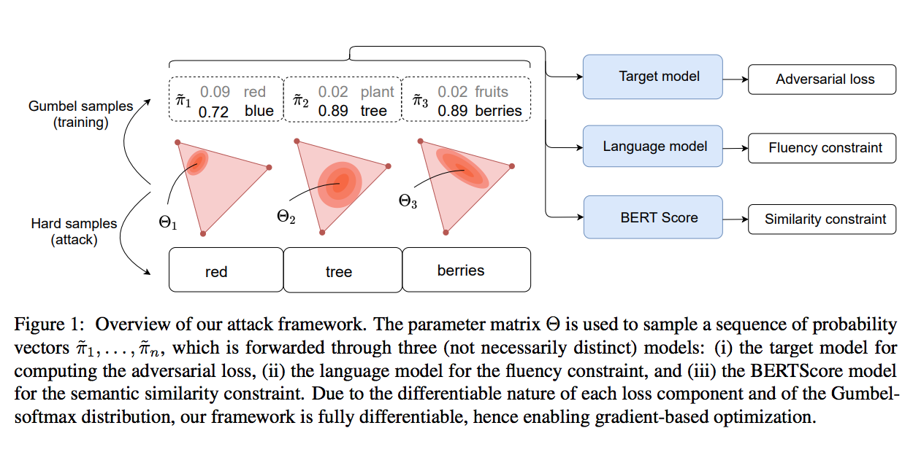
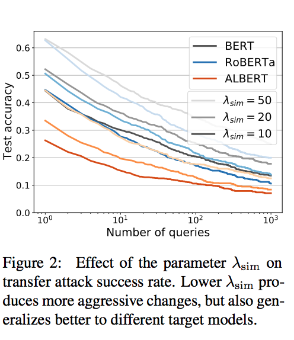
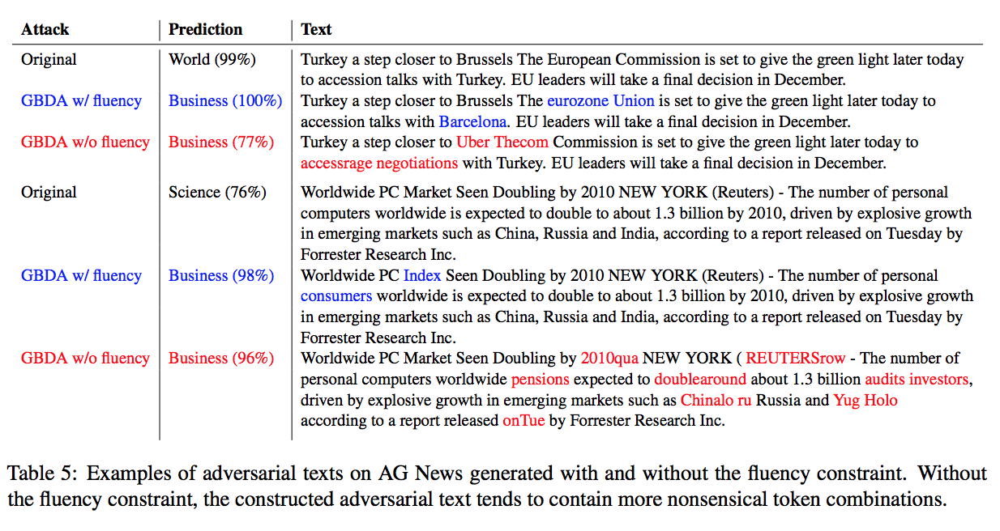

# Gradient-based Adversarial Attacks Against Text Transformers

## Summary

| Model Name| Model Type (Encoder-Decoder, etc.)   | Pre-train Objective |  Tokenization  | Vocab Size | OOV Handling | Embeddings | Attention | Activations | Parameters | Training| Pre-Train Data | Batch Size |
|   :----: |   :----:   |     :----:   |    :----:   |  :----:   |  :----: |   :----:  |    :----: |    :----:   |    :----:   |:----:   |:----:  |:----:   | 


## TL;DR

The study of adversarial attacks is motivated by the observation that DL models can be tricked to come to completely different conclusions based on small perturbations of an input. 

Generally, these adversarial examples are derived from an optimization problem with some *adversarial loss* that maximizes prediction error subject to some constraints, such as fluency or perceptability. Unlike pixels in images, which are drawn from a continuous distribution, the tokens in NLP are discrete in nature. To overcome this problem, in NLP adversarial attacks are generally heuristic in nature where token-level replacement candidates are explored in an exhaustive search (which can be computationally expensive).

**Adversarial Attacks**:

Let's say that a classifier ```h``` is trained to predict a label ```y_label``` given an example ```x```, i.e.: ```y_label = h(x)```. An adversarial example, ```x'``` is defined such that it is "close" to x as defined by some function ```p(x,x')<eps``` and yet ```y_label != h(x')```. This closeness can be defined as <ins>perceptibility</ins>, i.e., the semantic meaning of ```x',x``` are similar. These examples are considered adversarsial because a human would be able to correctly label, but the model fails to make that connection. 

**What is Adversarial Loss?**:

To derive said adversarial examples, there is usually an adversarial loss such as <ins>margin loss</ins> whereby a model misclassifies ```x``` by some margin ```k``` subject to the percetibility constraint.

However, the issue here is that this objective function usually cannot be solved via GD since the space of vectors, ```x``` is *discrete*.

**How These Models Are Measured**: 

When papers report how well they did, they report degredation numbers, i.e.: "BERT-Attack reduced accuracy from 94.2 --> 10.6".

**The Gist**:

While in CV adversarial attacks were able to degrade performance to ~10%, NLP SOTA was hitting only 10%.

The authors suggest <ins>Gradient-based Distributional Attack (GBDA)</ins> as a general approach to generating adversarial examples. Rather than constructing a single adversarial example, the authors are generating a <ins>distribution</ins>. This distribution is based on the <ins>Gumbel-Softmax</ins> distribution (great paper explaining this distribution [here](https://arxiv.org/pdf/1611.01144.pdf)). To enforce the constraint of perceptibility, the authors use BERTscore; to enforce fluency, they enforce language perplexity. Ultimately, all 3 of these are components of one large loss function that is <ins> fully differentiable</ins> and can be solved via gradient-descent. The outcome is a continuous, adversarial distribution that can be sampled to query different target models. (Figure 1 illustrates this well.)

**The Adversarial Distribution**:

The problem set forth is a minimization problem of the adversarial loss function with respect to the token distribution. However, the token distribution is a <ins>categorical(read: discrete)</ins> distribution is therefore inherently <ins>non-differentiable</ins>. 

To get around this, the authors drop in <ins>probability vectors instead of tokens</ins> and then use the Gumbel-softmax approximation to take the gradient. That is to say, <ins>the Transformer is taking in the average embedding of tokens from this G-S probability space</ins>. The goal is to optimize the probability distribution such that we minimize the loss which comprises of the 3 terms mentioned earlier (using 2 hyper-parameters, ```lambda```, to control the constraints).

## Art

### Figure 1: Overview
A depiction of the whole setup. Notice that the inputs to the different models that make up the 3 loss function components are average embeddings weighted by the probability matrix. This probability matrix is our "knob".



(from original paper)

### Figure 2: Constraint Effect on Attack Rate



(from original paper)

### Table 5: Fluency Constraint Illustrations
Great visuals showing how non-sensical adversarsial attacks can be without this fluency constraint.



(from original paper)


