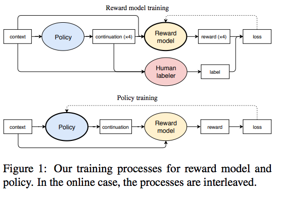
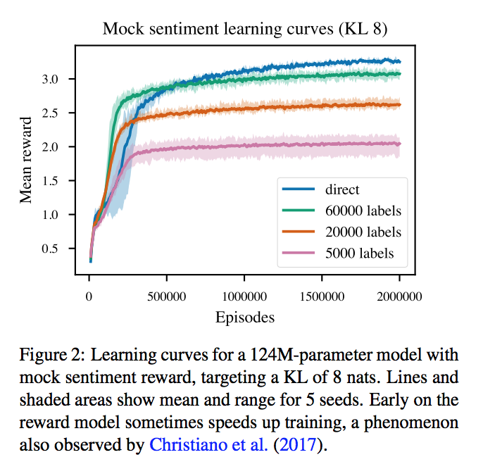
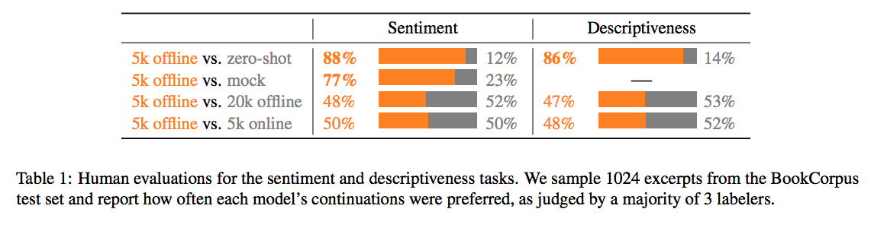

# Fine-Tuning Language Models from Human Preferences

## Summary

| Model Name| Model Type (Encoder-Decoder, etc.)   | Pre-train Objective |  Tokenization  | Vocab Size | OOV Handling | Embeddings | Attention | Activations | Parameters | Training| Pre-Train Data | Batch Size |
|   :----: |   :----:   |     :----:   |    :----:   |  :----:   |  :----: |   :----:  |    :----: |    :----:   |    :----:   |:----:   |:----:  |:----:   | 


## TL;DR

The goal is to explore the idea of using reinforcement learning (RL) to learn value functions that are complex and defined by human judgment via reward learning.

In this paper, pre-trained models are fine-tuned with RL rather than the usual supervised learning objective. Interestingly, to prevent the model from drifting too far from a pre-trained model, they use <ins>KL divergence</ins>to keep the model from not straying from the pre-trained distribution.


**Fine-tuning**: 

This RL, human preference task is defined 2 ways:


1. <ins>Stylistic continuation</ins>: 5k human comparisons were made where a human chose the best of 4. 

The goal is to learn the reward function that weighs ```r(input,output_i)``` via  a softmax loss function. This function is penalized by a KL term that considers the language model probability distribution. There is also a separate policy function ```pi```` that is trained via Proximal Policy Optimization (PPO). The policy function is initialized by the language model. 

2. <ins>Summarization tasks</ins>: 60k human-curated examples where someone copies relevant sections of a larger text. 

**Stylistic results**: 

1. <ins>RL fine-tuned v. zero-shot</ins> -> human won **86%** of the time 

2. <ins>RL fine-tuned v. supervised fine-tuned</ins> -> human won **77%** of the time 

**Summarization results**: 

The authors were underwhelmed by these results, believing that stylistic tasks require very little data.


## Art

### Figure 1: Reward modeling and policy training



(from original paper)

### Figure 2: Reward as a function of data



(from original paper)

### Table 1: Human evaluations



(from original paper)
