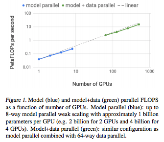
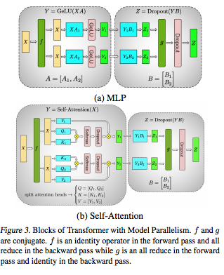
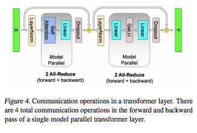
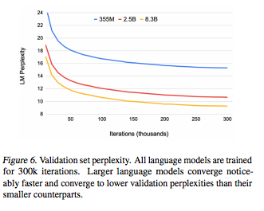
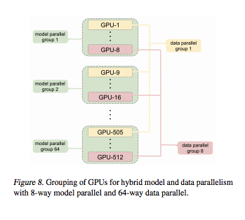

# Megatron-LM: Training Multi-Billion Parameter Language Models Using
Model Parallelism

## Summary

| Model Name| Model Type (Encoder-Decoder, etc.)   | Pre-train Objective |  Tokenization  | Vocab Size | OOV Handling | Embeddings | Attention | Activations | Parameters | Training| Pre-Train Data | Batch Size |
|   :----: |   :----:   |     :----:   |    :----:   |  :----:   |  :----: |   :----:  |    :----: |    :----:   |    :----:   |:----:   |:----:  |:----:   |

## TL;DR

The goal is to illustrate how to train very large transformer models via intra-layer model parallelization for 1BN+ parameter models. The cool thing is that it can be implemented natively in PyTorch. 

Model parallelism is an essential part of training large LMs, with the sheer size of parameter spaces, ADAM parameters, etc. Mesh-Tensorflow is an example of a framework for model parallelism, but require rewriting the model, special compilers.

The authors make the following observations in this paper:

1. They show an intra-layer model-parallelism that is achievable by tweeking existing Transformer architecture without special code/compilers. 
2. They show they can scale the model up to 76% scaling efficiency using 512 GPUs. 
3. Re-arranging the placement of layer normalization in BERT **dramatically** increases the accuracy of the model as it scales. 
4. They achieve SOTA on many benchmarks. 

**Data v. Model Parallelism**:

<ins> Data Parallelism </ins>: A dataset is sharded and fixed onto a set of workers. These workers will usually send the gradient results to another server to then retrieve update weights. It is calculating gradients on N copies of the same model. 

Going purely the data parallelism route, *weak scaling* can be achieved by increasing the mini-batch size proportional to the number of workers. Some memory optimizations are useful here - for instance, **activation checkpointing**, which involves not caching forward pass calculations, but insread re-computing them in backprop (trading speed for memory). The issue here is that **the model must fit onto one worker**. Some authors have created parameter sharing models (think alBERT), but the others think this is not adequate. 

<ins> Model Parallelism </ins>: Memory usage and computation of a model is distributed across multiple workers. 

Here there are 2 approaches: *pipeline model parallelism* and *distributed tensor computation*. In the former, operations cascade in serial across devices. **GPipe** is a model parameter server that tackles this issue. Sometimes this approach can effect the optimizer itself, which in turn effects the accuracy.  In the latter, tensor calculations are distributed. An example library is **Mesh-Tensorflow**. This requires a special graphical compilation, but the authors observe some interesting ideas, such as parallelizing the attention heads. 

**Their Tweaks**: 

**TL;DR**: All of this is done through **GEMM**: i.e., matrix multiplication + concatentation. Rather than having each part computation done serially across nodes (done basically to handle GPU cache issues), they have "model parallel regions" (here is the **model parallelism**)-  these regions remember multiple sets of parameters across models and do parallel calculations. The results are then "reduced" and then propogated to **data parallel** nodes that compute the rest of the graph in parallel. The data parallel components are in sync because the **random seed** is the same across all these nodes, ensuring synchronicity (see fig 8.)

1. *GeLU*: Their first observation is to split the data column-wise and concatenate the activation (GeLU) results. They then "reduce" across GPUs before passing to dropout layer. 
2. *Attention*: They then exploit the column-wise parallelism of multi-head attention. 
3. *Embeddings*: Similar idea as before, they parallelize the input embedding and fuse the output embedding with logit and also parallelize are return scalars.

## Art

### Figure 1: FLOPs Efficiency w/ Data and Model Parallelization
Combining both practices leads to better performance.

(from original paper)

### Figure 3: Layer Parallelism
Illustration of how the layer parallelism works.

(from original paper)

### Figure 4: Communication Across Layers

(from original paper)

### Figure 6: Larger Models Are Better
Lower ppl on val sets with larger models.

(from original paper)

### Figure 8: Model v. Data Parallelization

(from original paper)

