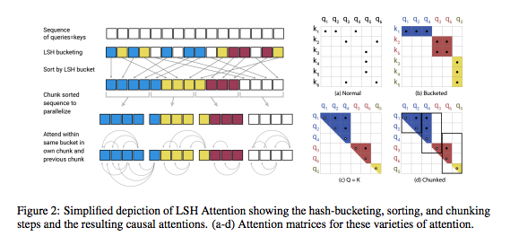

# REFORMER: THE EFFICIENT TRANSFORMER

## Summary

| Model Name| Model Type (Encoder-Decoder, etc.)   | Pre-train Objective |  Tokenization  | Vocab Size | OOV Handling | Embeddings | Attention | Activations | Parameters | Training| Pre-Train Data | Batch Size |
|   :----: |   :----:   |     :----:   |    :----:   |  :----:   |  :----: |   :----:  |    :----: |    :----:   |    :----:   |:----:   |:----:  |:----:   |


## TL;DR

The basic premise is that the authors are exploring ways of improving the efficiency of Transformers. By replacing the usual dot-product (or scaled-dot-product) attention mechanism that is ```O(T^2)``` in complexity, they suggest a ***locality-sensitive hashing*** that reduces complexity to ```O(T*log(T))```. This, along with some changes in residuals, is the basis of the **Reformer** model.

Latest class of Transformer models are ~ 0.5B per layer, up to 64 layers, up to 11k tokens of text in a single example (i.e., really long text), as well as multi-modal models. These models can realistically only be trained in industrial labs, cannot be fine-tuned on a single GPU.

**Memory Usage**: 

The authors observes that, at face value, you might expect the following math for memory usage:

1. 0.5B of floats per layer -> 2GB of memory. 
2. 0.5B for embeddings per batch. 
3. 17GB of text.

With this math, a Transformer layer _should_ fit onto a modern GPU/TPU. **However**, this doesn't account for:

1. **Activations**: storing ```O(N)``` activations for back-prop, especially in the FFN layers. 
2. **Dense Attention**: Attention layers are ```O(L^2)``` in runtime and memory complexity. 

This makes the memory explode. 

Their model, the **Refomer** implements the following ideas:

1. **Reversible layers**: Following a paper by Uber that introduces the idea of reversible layers, they reduce ```O(N) -> O(1)``` space complexity by storing 1 set of activations and performing backprop, simply by storing the activations and their derivatives for the top layer in the sequence. 
2. **Splitting activations inside FFN**. 
3. **Replace Dot-Product Attention Mechanism (Biggest Contribution)**: Replace the usual ```O(L^2)``` woth a "locality-sensitive hashing" that is ```O(L*log(L))``` space complexity. 

Assuming Q,K,V are ```(batch_size, max_seq_lenth, dim_model)``` The ```Q*K_transpose``` term is ```(batch_size,length,length)``` can be huge in the case of very long sequences.

**How Locality-Sensitive Hashing (LSH) Works**: (Btw, fantastic explanation of this in the paper) 

The basic idea presented is this: ```Q*K_transpose``` is large, but we are really interested in ```softmax(Q*K_transpose)``` which converts the smallest products ```q_i*k_j-->0``` and the largest products ```q_i*k_j-->1```. Thus, finding the largest ```q_i*k_j``` is the task, which is a **nearest neighbors problem**. The math details are in the paper, but this done with a **hashing function** where nearby vectors get the same hash with a high probability. There are issues with the un-evenness of hashes, etc that are discussed in more detail in the paper, including creating more uniformity via multiple sequential hashes.

## Art

### Figure 2: LSH Attention Schematic 



(from original paper)