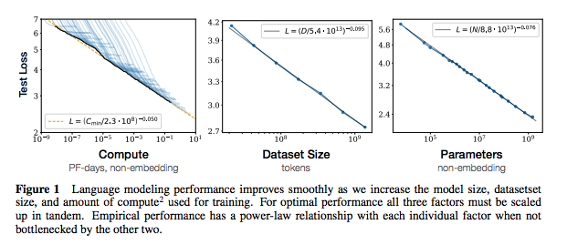
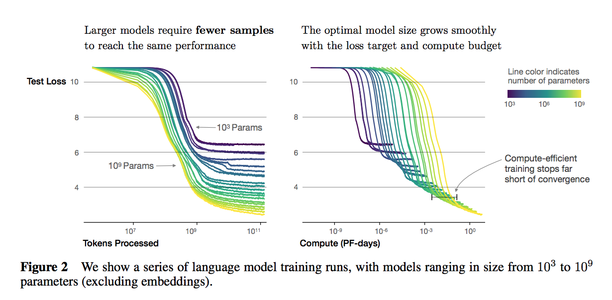
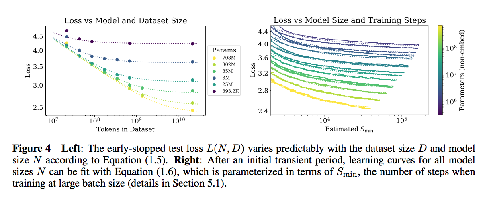

# Scaling Laws for Neural Language Models

## Summary

| Model Name| Model Type (Encoder-Decoder, etc.)   | Pre-train Objective |  Tokenization  | Vocab Size | OOV Handling | Embeddings | Attention | Activations | Parameters | Training| Pre-Train Data | Batch Size |
|   :----: |   :----:   |     :----:   |    :----:   |  :----:   |  :----: |   :----:  |    :----: |    :----:   |    :----:   |:----:   |:----:  |:----:   | 

## TL;DR

Given the inspiring results achieved in language tasks by transformers (near human-level performance), the authors set out to understand the quiddity of how hyper-parameters in the transformer training process affect the results. 

<ins>This is a hugely important "meta" paper exploring the hyper</ins>.

Their findings are the following: 

1. **Power law relationships**: Model performance (as quantified by **test loss**) is most strongly influenced by three factors: <ins> N </ins> (model parameters - embedding_size); <ins> D </ins> (size of dataset); <ins> C </ins> (size of compute used for training).

2. ** Overfitting ** occurs if N (parameters) and D (training size) are not scaled proportionally together. For examply, if scaling the model size 8x, data size must be roughly 5x.

3. **Training curves** appear independent of model size - this allows some predictability in terms of what to expect when a model is <ins> trained longer </ins>. 

4. **Transfer penalty** appears to be a constant offset - i.e., <ins> results on train::val set correlate with hold-out::test set despite different distributions </ins>.

5. Larger models reach the same level of performance with <ins>fewer datapoints </ins> and <ins> fewer optimization steps </ins> - what is called "more sample-efficient".

6. Further, larger models actually achieve optimal performance <ins> when stopped early before convergence </ins>.  

The authors fit **power laws** to all of these relationships using <ins> WebText </ins>, BPE with vocab size 50257, measuring performance over 1024-token context window and cross-entropy. They use their usual decoder-only model.

**Note**: They have many sections and appendices worth checking out. As always, OpenAI papers are designed for readability.

## Art

### Figure 1: Scaling Laws

(from original paper)

### Figure 2: Training Curves

(from original paper)

### Figure 4: Sample Efficiency of Large Models

(from original paper)

