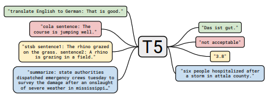
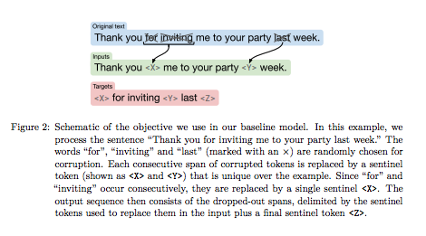
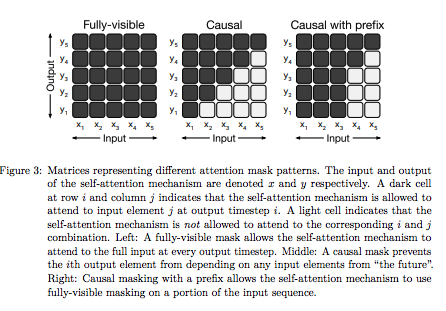
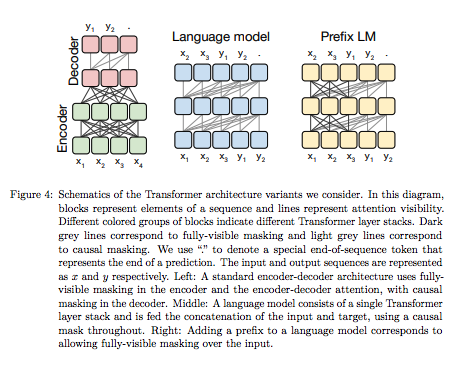
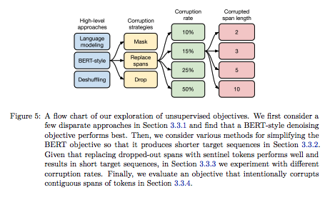
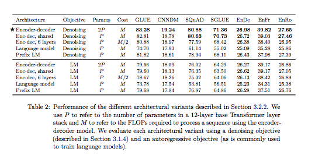
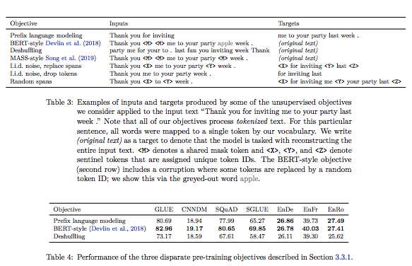
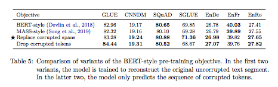

# Exploring the Limits of Transfer Learning with a Unified
Text-to-Text Transformer

## Summary

| Model Name| Model Type (Encoder-Decoder, etc.)   | Pre-train Objective |  Tokenization  | Vocab Size | OOV Handling | Embeddings | Attention | Activations | Parameters | Training| Pre-Train Data | Batch Size |
|   :----: |   :----:   |     :----:   |    :----:   |  :----:   |  :----: |   :----:  |    :----: |    :----:   |    :----:   |:----:   |:----:  |:----:   |
| T5 | Encoder-Decoder | **BERT-style denoising objective**: Similar to MLM, model is trained to predict missing or corrupted tokens in input. 15% of tokens are randomly sampled and dropped out. (Note: They experimented with many variants) | **SentencePiece** | 32k (across many languages w/ 10:1 English-to-non-English) | Same as BERT | Just token embeddings | Self-attention + encoder-decoder attention (per layer) | ReLU | This study looks at many variants, but the base is similar to BERT_base: <ul><li> 12 blocks (encoder + decoder) </li><li> hidden_size == embed_size = 768 </li><li> FFN_dim=3072 (4*hidden) </li></ul> Utimately, about **twice the size of BERT --> 220MM params**. | <ul><li> **Pre-training:** 2^19 steps for pre-training. </li><li> Use **adaFactor** optimization with **inverse square root** LR scheduler </li><li> **Greedy decoding** at test time </li><li> **Fine-tuning**: 2^18 steps always with same batch_size dimensions, LR=0.001, **5k checkpoints and report results for highest validation performance**. | Common Crawl's C4 data (20 TB) | T=512, batch= 128 with packing such that each batch is approximately **65k tokens** (much smaller than other studies) |

## TL;DR

**MOST IMPORTANT TAKE AWAY**: This problem setup of "text-to-text" allows for zero-shot transfer to other problems without the need of specialized output heads (unlike say BERT or GPT).

Raffel et al. seek out to do a comparative study of different pre-training, architectures, unlabeled datasets, transfer approaches, etc and sort out which features are most important in the transformer approach. Further, they introduce a 20 TB dataset from the Common Crawl project, C4. Encoder-decoder with their "denoising" pre-training objective did best.

<ins>Note</ins>: Worth reading the intro section - very good description of transfer learning and Transformer architecture.

**Model**: The model is very similar to the original Transformer, with a few simplifying design decisions, among them: 
1. Layer normalization has no bias term. 
2. Layer normalization is outside residual path. 
3. **Positional information**: instead of fixed embeddings for each position (such as the original sinusoidal term), a scalar is added to each corresponding softmax calculation for attention weights. These positional embeddings are used as offsets for the key,query concept in the attention mechanism, as well as other layers. They only do this for up to 128 tokens. 

**Baseline Model**: Encoder, decoder are similar to BERT_base.

To achieve model and data parallelism, they use the **Mesh TensorFlow** library. 

**Pre-processing**: The authors do a few interesting things to prepare the C4 data. For instance, they remove all documents they believe are not English using *langdetect*; they dedup the data; remove code; remove placeholder data; remove "bad words". 

**Training Problem Statement**: They combine all the different tasks into an encoder-decoder or "text-to-text" problem. Specifically, they add a prefix to the input such as " translate X to Y: " or "<fine-tuning-task>:", followed by output "<LABEL>" or "<translation>". In the case of classification, if the wrong label is produced, it is scored as wrong. With this setup, their encoder-decoder model is not identical in nature to a model like BERT, which produces a single output, but shares the same spirit. 

They run these studies across several GLUE and superGLUE benchmarks, using many different architecture variants (note: not a Cartesian product). See Table 2 below for info.

**Final Note** this is a pretty thorough study with lots of information. I strongly recommend examining their different studies in detail.

## Art

### Figure 1: Text-to-Text Encoder-Decoder Design
This is a useful illustration to visualize how all the different NLP problems are mapped to the same problem space of input -> output in the fine-tuning stage. Notice that the inputs are appended with task descriptions.

(from original paper)

### Figure 2: Corrupted Token Prediction (Pre-Training)
This is a schematic illustrating the pre-training, unlabeled objective. 

(from original paper)

### Figure 3: Self-Attention Patterns
This is a great visualization of the different types of self-attention. The Fully-visible is what is found in BERT; the "causal" or auto-regressive is GPT.

(from original paper)

### Figure 4: Transformer Architectures
This is a great visualization of variants of different language models/transfomers.

(from original paper)

### Figure 5: Pre-Training Experiments
This is a depiction of the different variants of pre-training objectives.

(from original paper)

### Table 2: Perfomance of Different Architectures

(from original paper)

### Table 3: Description of Different Pre-Training Objectives/ Noising
Honestly, this is one of the best tables/high-levels of different model objectives.

(from original paper)

### Table 5: Performance Different Pre-Training Objectives/ Noising

(from original paper)
